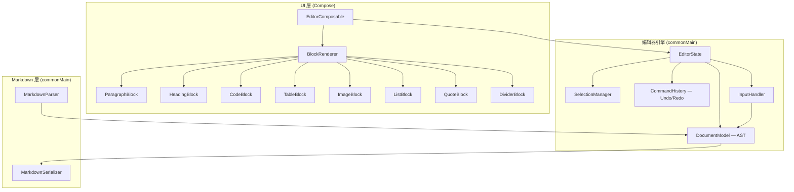
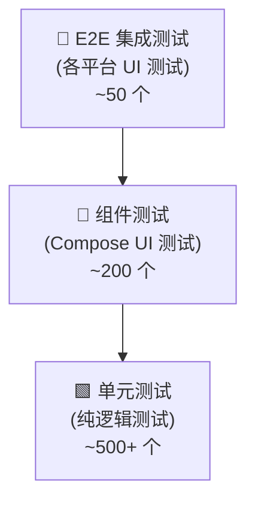

# Compose Multiplatform WYSIWYG Markdown Editor — 需求规格说明

> 一个基于 Compose Multiplatform 的完全原生、跨全平台（Android / iOS / Desktop / Web）所见即所得 Markdown 编辑器库。

---

## 一、项目愿景与范围

### 1.1 目标

构建一个**生产级**的 Compose 原生 Markdown WYSIWYG 编辑器，达到与 Web 端 TipTap / Milkdown / Notion 编辑器同等的功能完整度，同时保持 Compose 原生的性能与体验优势。

### 1.2 平台支持

| 平台 | 框架 | 最低版本 |
|------|------|---------|
| Android | Jetpack Compose | API 24+ |
| iOS | Compose Multiplatform (Kotlin/Native) | iOS 15+ |
| Desktop | Compose Desktop (JVM) | JDK 17+ |
| Web | Compose for Web (Wasm) | 现代浏览器 |

### 1.3 技术约束

- **纯 Kotlin Multiplatform**：核心逻辑必须为 `commonMain`，禁止使用 JVM-only 或平台特定解析库
- **零 WebView 依赖**：全部使用 Compose 原生渲染
- **Markdown 标准**：遵循 [CommonMark 0.31](https://spec.commonmark.org/0.31/) + [GFM 扩展](https://github.github.com/gfm/)

---

## 二、整体架构

### 2.1 分层架构



### 2.2 核心设计原则

| 原则 | 说明 |
|------|------|
| **Block 架构** | 文档 = 有序 Block 列表，每个 Block 独立 Composable，通过 `LazyColumn` 排列 |
| **不可变状态** | `DocumentModel` 为不可变数据结构，每次修改产生新状态 |
| **单向数据流** | 用户输入 → Command → 新 DocumentModel → UI 重组 |
| **插件化渲染** | 每种 Block 类型有独立的 Renderer，可替换/扩展 |
| **平台抽象** | 通过 `expect/actual` 处理平台差异（剪贴板、文件选择、键盘事件等） |

---

## 三、功能需求

### 3.1 Block 级别元素

| ID | 功能 | 优先级 | 描述 |
|----|------|--------|------|
| B-01 | **段落 (Paragraph)** | P0 | 普通文本段落，支持 Inline 样式 |
| B-02 | **标题 (Heading)** | P0 | H1–H6，可视化大小区分，支持通过 `# ` 快捷输入 |
| B-03 | **代码块 (Code Block)** | P0 | 多行代码块，支持语言标签，等宽字体，语法高亮 |
| B-04 | **引用块 (Blockquote)** | P0 | 左侧竖线样式，支持嵌套，内部支持所有 Block 类型 |
| B-05 | **无序列表 (Unordered List)** | P0 | 项目符号列表，支持多级嵌套 (Tab 缩进) |
| B-06 | **有序列表 (Ordered List)** | P0 | 编号列表，自动编号，支持多级嵌套 |
| B-07 | **任务列表 (Task List)** | P0 | 复选框列表 `- [ ]` / `- [x]`，可点击切换 |
| B-08 | **表格 (Table)** | P1 | GFM 表格，支持对齐，可视化编辑行/列，支持增删行列 |
| B-09 | **图片 (Image)** | P1 | 显示图片，支持 alt 文本、URL/本地路径，可调整大小 |
| B-10 | **分割线 (Thematic Break)** | P1 | `---` / `***` / `___` |
| B-11 | **数学公式块 (Math Block)** | P2 | `$$...$$` LaTeX 数学公式渲染 |
| B-12 | **脚注定义 (Footnote)** | P2 | `[^1]: 内容` |
| B-13 | **折叠块 (Details)** | P2 | `<details><summary>` 可展开/折叠 |
| B-14 | **Mermaid 图表** | P3 | Mermaid 语法图表渲染 |

### 3.2 Inline 级别元素

| ID | 功能 | 优先级 | 描述 |
|----|------|--------|------|
| I-01 | **加粗 (Bold)** | P0 | `**text**` / `__text__`，实时渲染为粗体 |
| I-02 | **斜体 (Italic)** | P0 | `*text*` / `_text_`，实时渲染为斜体 |
| I-03 | **删除线 (Strikethrough)** | P0 | `~~text~~` |
| I-04 | **行内代码 (Inline Code)** | P0 | `` `code` ``，等宽字体 + 背景色 |
| I-05 | **链接 (Link)** | P0 | `[text](url)`，可点击跳转，编辑态可修改 |
| I-06 | **行内图片 (Inline Image)** | P1 | ``，在文本流中内联显示 |
| I-07 | **行内数学 (Inline Math)** | P2 | `$formula$` |
| I-08 | **高亮 (Highlight)** | P2 | `==text==` |
| I-09 | **上标/下标** | P2 | `^sup^` / `~sub~` |
| I-10 | **脚注引用** | P2 | `[^1]` |
| I-11 | **自动链接 (Autolink)** | P1 | 自动识别 URL 并转为可点击链接 |

### 3.3 编辑器交互

| ID | 功能 | 优先级 | 描述 |
|----|------|--------|------|
| E-01 | **光标导航** | P0 | 方向键在 Block 间无缝移动，包括跨 Block 上下移动 |
| E-02 | **文本选择** | P0 | 鼠标/触摸拖选，Shift+方向键，跨 Block 选区 |
| E-03 | **全选** | P0 | Ctrl/Cmd+A 选择全部内容 |
| E-04 | **撤销/重做** | P0 | Ctrl/Cmd+Z/Y，基于 Command 模式 |
| E-05 | **复制/粘贴** | P0 | 支持纯文本和 Markdown 格式的复制粘贴 |
| E-06 | **从外部粘贴 HTML** | P1 | 粘贴 HTML 内容时自动转换为 Markdown Block |
| E-07 | **拖拽排序** | P1 | Block 级别拖拽重新排序 |
| E-08 | **块转换** | P0 | 在行首输入 `# ` 自动转为标题，`- ` 转列表，`> ` 转引用等 |
| E-09 | **快捷键** | P0 | Ctrl/Cmd+B/I/K 等标准格式化快捷键 |
| E-10 | **Slash 命令** | P1 | 输入 `/` 弹出 Block 类型选择菜单 |
| E-11 | **工具栏** | P0 | 浮动/固定工具栏，显示当前样式状态 |
| E-12 | **查找替换** | P2 | Ctrl/Cmd+F 文档内查找替换 |

### 3.4 数据层

| ID | 功能 | 优先级 | 描述 |
|----|------|--------|------|
| D-01 | **Markdown 导入** | P0 | 从 Markdown 字符串解析为 DocumentModel |
| D-02 | **Markdown 导出** | P0 | 将 DocumentModel 序列化为标准 Markdown |
| D-03 | **HTML 导出** | P1 | 将 DocumentModel 导出为 HTML |
| D-04 | **实时双向同步** | P0 | 编辑操作实时更新内部 Markdown 表示 |
| D-05 | **文档变更监听** | P0 | 提供回调 API 通知外部文档已变更 |
| D-06 | **局部更新** | P0 | 仅重新渲染变更的 Block，非全量重绘 |

---

## 四、非功能需求

### 4.1 性能

| 指标 | 目标值 |
|------|--------|
| 首次渲染 (1000 行文档) | < 200ms |
| 按键输入延迟 | < 16ms (60fps) |
| 滚动流畅度 | 60fps 无掉帧 |
| 内存占用 (10000 行文档) | < 50MB |
| Block 增量渲染 | 仅重组变更 Block |

### 4.2 无障碍 (Accessibility)

- 所有交互元素提供 `contentDescription`
- 支持 TalkBack (Android) / VoiceOver (iOS)
- 键盘完全可操作

### 4.3 国际化

- 支持 RTL (从右到左) 文本布局
- 支持 CJK 字符输入与换行
- 支持 Emoji 完整渲染

### 4.4 API 设计

```kotlin
// 核心 API 示例
@Composable
fun MarkdownEditor(
    state: MarkdownEditorState,
    modifier: Modifier = Modifier,
    readOnly: Boolean = false,
    config: MarkdownEditorConfig = MarkdownEditorConfig.Default,
    blockRenderers: BlockRendererRegistry = BlockRendererRegistry.Default,
    toolbar: @Composable (ToolbarState) -> Unit = { DefaultToolbar(it) },
    onValueChange: (String) -> Unit = {},
)

// 状态管理
val state = rememberMarkdownEditorState(
    initialMarkdown = "# Hello World",
)

// 程序化操作
state.toggleBold()
state.insertBlock(CodeBlock(language = "kotlin", content = "..."))
state.getMarkdown() // 导出
state.setMarkdown("...") // 导入
```

---

## 五、自动化测试策略

### 5.1 测试金字塔



### 5.2 单元测试 (commonTest)

> **不依赖任何 UI 框架，纯 Kotlin 逻辑测试，占测试总量 60-70%**

#### 5.2.1 Markdown 解析器测试

| 测试类 | 覆盖场景 | 数量 |
|--------|---------|------|
| `HeadingParserTest` | H1-H6 解析、ATX/Setext 风格、特殊字符标题 | ~15 |
| `InlineParserTest` | 加粗/斜体/删除线/代码/链接的各种嵌套和边界情况 | ~40 |
| `ListParserTest` | 有序/无序/任务列表，嵌套，续行 | ~25 |
| `CodeBlockParserTest` | 缩进代码块、围栏代码块、语言标签 | ~15 |
| `TableParserTest` | 基本表格、对齐、空单元格、转义管道符 | ~20 |
| `BlockquoteParserTest` | 单层/多层嵌套、嵌套其他 Block | ~10 |
| `ComplexDocumentParserTest` | 混合所有元素的完整文档 | ~10 |
| **CommonMark 合规测试** | 导入 CommonMark spec 测试套件 (~650 cases) | ~650 |

#### 5.2.2 Markdown 序列化器测试

| 测试类 | 覆盖场景 |
|--------|---------|
| `SerializerRoundTripTest` | 解析→序列化→再解析，验证等价性 |
| `SerializerFormattingTest` | 输出格式规范性（空行、缩进、列表标记等） |
| `SerializerEdgeCaseTest` | 特殊字符转义、空文档、超长行 |

#### 5.2.3 DocumentModel 操作测试

| 测试类 | 覆盖场景 |
|--------|---------|
| `InsertBlockTest` | 在各位置插入各类型 Block |
| `DeleteBlockTest` | 删除 Block、合并相邻段落 |
| `SplitBlockTest` | 在 Block 中间回车拆分 |
| `MergeBlockTest` | 在 Block 开头退格合并 |
| `MoveBlockTest` | 拖拽排序后文档结构 |
| `BlockTransformTest` | 段落转标题、段落转列表等类型转换 |
| `NestedBlockTest` | 列表嵌套、引用嵌套深度操作 |

#### 5.2.4 选区与光标测试

| 测试类 | 覆盖场景 |
|--------|---------|
| `CursorNavigationTest` | 上下左右移动，跨 Block 边界 |
| `SelectionTest` | 单 Block 选区、跨 Block 选区、全选 |
| `SelectionOperationTest` | 对选区应用样式（加粗/斜体等）、删除选区 |

#### 5.2.5 命令与历史测试

| 测试类 | 覆盖场景 |
|--------|---------|
| `UndoRedoTest` | 单步撤销/重做、连续操作、撤销后新编辑截断历史 |
| `BatchCommandTest` | 组合命令原子性 |
| `HistoryLimitTest` | 历史栈大小限制、内存释放 |

#### 5.2.6 Inline 样式操作测试

| 测试类 | 覆盖场景 |
|--------|---------|
| `ToggleBoldTest` | 选区加粗/取消加粗、部分重叠、空选区 toggle |
| `ToggleItalicTest` | 同上 |
| `ToggleLinkTest` | 插入/编辑/移除链接 |
| `NestedInlineTest` | 加粗套斜体、链接中加粗等嵌套 |
| `InlineConflictTest` | 冲突样式的处理（如代码中不能加粗） |

### 5.3 组件测试 (Compose UI Test)

> **使用 `@OptIn(ExperimentalTestApi::class) runComposeUiTest` 进行 UI 组件测试**

#### 5.3.1 Block 渲染测试

```kotlin
// 示例：验证标题渲染
@Test
fun heading1_rendersWithCorrectStyle() = runComposeUiTest {
    setContent {
        HeadingBlock(level = 1, content = "Hello")
    }
    onNodeWithText("Hello").assertExists()
    // 验证字体大小、粗细
}
```

| 测试组 | 覆盖场景 |
|--------|---------|
| 每种 Block 类型的渲染正确性 | 样式、布局、嵌套内容 |
| Inline 样式的可视化渲染 | 加粗粗细、斜体倾斜、代码背景色 |
| 表格布局测试 | 列宽分配、对齐、边框 |
| 图片加载与展示 | 占位符、加载中、加载失败状态 |
| 代码块语法高亮 | 各语言关键词正确着色 |

#### 5.3.2 交互测试

| 测试组 | 覆盖场景 |
|--------|---------|
| `ToolbarInteractionTest` | 点击工具栏按钮 → 验证样式变化 |
| `KeyboardShortcutTest` | 模拟 Ctrl+B → 验证加粗应用 |
| `SlashCommandTest` | 输入 `/` → 菜单出现 → 选择 → Block 插入 |
| `BlockTransformInputTest` | 输入 `# ` → 验证段落转为 H1 |
| `EnterKeyTest` | 回车拆分 Block、列表中回车新增项、空列表回车退出列表 |
| `BackspaceTest` | Block 开头退格合并、列表降级、引用退出 |
| `TabIndentTest` | 列表 Tab 缩进、Shift+Tab 减少缩进 |
| `DragDropTest` | Block 拖拽重排 |
| `ClipboardTest` | Ctrl+C/V 复制粘贴内容验证 |

#### 5.3.3 编辑器集成测试

| 测试组 | 覆盖场景 |
|--------|---------|
| `FullEditorRenderTest` | 加载完整 Markdown 文档 → 验证所有 Block 正确渲染 |
| `EditAndExportTest` | 编辑操作 → 导出 Markdown → 验证输出正确 |
| `LargeDocumentTest` | 1000+ 行文档的渲染性能 |
| `ReadOnlyModeTest` | 只读模式下所有编辑操作被禁用 |
| `ConfigCustomizationTest` | 自定义配置（字体、颜色、间距）生效 |

### 5.4 平台特定测试

| 平台 | 测试重点 |
|------|---------|
| **Android** | 软键盘输入、IME 组合、触摸手势、屏幕旋转 |
| **iOS** | iOS 键盘交互、安全区域适配、手势冲突 |
| **Desktop** | 鼠标交互、右键菜单、窗口缩放、多显示器 DPI |
| **Web** | 浏览器兼容性、Wasm 性能 |

### 5.5 测试框架与工具

| 类别 | 工具 |
|------|------|
| 单元测试 | `kotlin.test` (commonTest) |
| UI 测试 | `compose.ui.test` (runComposeUiTest) |
| 断言 | `kotlin.test` 断言 + 自定义 DSL |
| 快照测试 | 自定义 Block 渲染快照对比 |
| 性能测试 | `measureTime` + 自定义 benchmark |
| CI | GitHub Actions (多平台矩阵构建) |

### 5.6 测试覆盖率目标

| 模块 | 行覆盖率 | 分支覆盖率 |
|------|---------|-----------|
| Markdown 解析器 | ≥ 95% | ≥ 90% |
| DocumentModel 操作 | ≥ 95% | ≥ 90% |
| 选区/光标逻辑 | ≥ 90% | ≥ 85% |
| 命令/历史 | ≥ 95% | ≥ 90% |
| UI 渲染 | ≥ 80% | ≥ 75% |
| 整体 | ≥ 90% | ≥ 85% |

---

## 六、项目模块划分

```
compose-markdown-editor/
├── core/                          # commonMain — 纯 Kotlin 逻辑
│   ├── parser/                    # Markdown → AST
│   ├── serializer/                # AST → Markdown / HTML
│   ├── model/                     # Document / Block / Inline 数据模型
│   ├── editor/                    # EditorState, SelectionManager, CommandHistory
│   └── commands/                  # 编辑命令 (InsertText, ToggleBold, SplitBlock...)
│
├── ui/                            # Compose UI 层
│   ├── editor/                    # MarkdownEditor Composable 主入口
│   ├── blocks/                    # 各 Block 类型的渲染 Composable
│   ├── inline/                    # Inline 样式到 AnnotatedString 的转换
│   ├── toolbar/                   # 工具栏组件
│   ├── selection/                 # 跨 Block 选区可视化
│   └── theme/                     # EditorTheme 主题配置
│
├── platform/                      # expect/actual 平台抽象
│   ├── clipboard/                 # 剪贴板操作
│   ├── keyboard/                  # 平台键盘事件映射
│   └── file/                      # 文件/图片选择
│
└── test/
    ├── commonTest/                # 单元测试 (解析、模型、命令)
    ├── composeTest/               # Compose UI 测试
    └── platformTest/              # 平台特定测试
```

---

## 七、里程碑计划

| 阶段 | 内容 | 预估周期 |
|------|------|---------|
| **M1 — 基础框架** | 文档模型 + 解析器 + 序列化器 + 基础段落/标题编辑 + 单元测试 | 4 周 |
| **M2 — 核心编辑** | Inline 样式 + 列表 + 引用 + 代码块 + 光标管理 + 撤销重做 | 4 周 |
| **M3 — 高级功能** | 表格 + 图片 + 任务列表 + 工具栏 + Slash 命令 | 4 周 |
| **M4 — 平台适配** | 各平台键盘/剪贴板/手势适配 + 平台测试 | 3 周 |
| **M5 — 扩展与优化** | 数学公式 + Mermaid + 性能优化 + 无障碍 | 3 周 |
| **M6 — 发布准备** | API 文档 + 示例应用 + CI/CD + 发布 Maven Central | 2 周 |

---

## 八、技术依赖

| 依赖 | 用途 | 平台 |
|------|------|------|
| `org.jetbrains.compose` | Compose Multiplatform 框架 | 全平台 |
| `org.jetbrains:markdown` | Markdown 解析 (纯 Kotlin) | commonMain |
| `coil3` / `kamel` | 图片异步加载 | 全平台 |
| `kotlin.test` | 测试框架 | commonTest |
| `compose.ui.test` | UI 测试 | composeTest |
